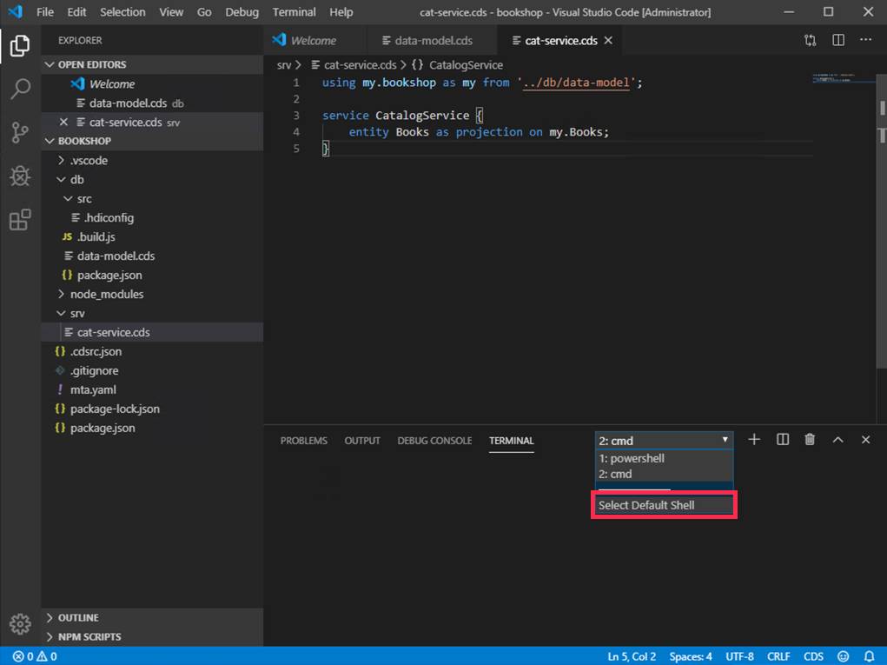

# Exercise 02 - Creating a new CAP project

In this exercise you'll become familiar with the workflow of creating a new CAP project from the command line, and discover how quickly you can get to a basic OData service serving a simple metadata document.

One of the challenges of building a full stack app using OData has been the production of an OData service - the definition of the metadata and the creation of the backend components to service the OData operations.

With Core Data & Services (CDS) as the definition language and CAP as the framework providing out-of-the-box services that respond to OData requests, that challenge has disappeared. It's very easy to get a basic OData service up and running in only a few minutes. Being able to rapidly get to a working metadata document has various benefits which we'll discuss at the end of this exercise.


## Steps

After completing these steps you'll be familiar with how you can use the `cds` command line tool to initialize a project with an OData service.


### 1. Initialize a new CAP project

> Before you start creating a new project we recommend that you create a dedicated directory for this CodeJam within your home  directory instead of any system directories (e.g. DO NOT work in `C:\Windows\System32\`).

For any new CAP based project you start by indirectly creating a directory containing various basic files. This can be achieved with the CDS command line tool `cds` which you installed in [exercise 01](../01/).

The `cds` tool should be available in your executable path, having been installed globally as part of the Node.js `@sap/cds` package.

:point_right: First, explore the `cds` command line tool by executing it with no parameters; you will see what options are available:

```sh
user@host:~
=> cds

USAGE

    cds <command> [<args>]
    cds <src>  =  cds compile <src>
    cds        =  cds help

COMMANDS

    i | init       jump-start cds-based projects
    c | compile    process models selectively
    m | import     add models from external sources
    s | serve      run servers locally
    r | repl       read-eval-event loop
    e | env        get/set cds configuration
    b | build      prepare for deployment
    d | deploy     e.g. to databases or cloud
    v | version    get detailed version information
    ? | help       get detailed usage information

  Learn more about each with:
  cds help <command> or
  cds <command> ?
```

Note that with `cds init` a new project can be quickly initialized.

:point_right: Explore what options are available with `cds init` with the `--help` option:

```sh
user@host:~
=> cds init --help
```

Amongst other things, you should see a `--modules` option to specify a list of modules to be created when the project is initialized, and also a `--verbose` option. The options `--mta`, `--db-technology` and `--insecure` are related to deployment to Cloud Foundry and access management in that context. `--skip-sample-models` avoids the creation of sample CDS source files which you will build step by step in this CodeJam yourself.

:point_right: Use all of these options to initialize a new project directory called `bookshop` thus:

```sh
user@host:~
=> cds init --modules db,srv --mta --insecure --db-technology hana --verbose --skip-sample-models bookshop
```

You should see output that looks similar to this:

```
Initializing project in folder bookshop.
Copying templates for type db to db ...
Creating mta file /private/tmp/bookshop/mta.yaml ...
Copying templates for type srv to srv ...
Creating mta file /private/tmp/bookshop/mta.yaml ...
Updating npm dependencies in /private/tmp/bookshop/package.json ...
Running npm install...
npm notice created a lockfile as package-lock.json. You should commit this file.
added 120 packages from 178 contributors and audited 220 packages in 6.978s
found 0 vulnerabilities

Done.
Learn about first steps at https://cap.cloud.sap/docs/get-started/in-a-nutshell
```


### 2. Open the project in VS Code

Now that the project has been initialized, it's time to explore it. The VS Code IDE is a comfortable environment in which to do so, so at this point you will open up the newly created `bookshop` directory in it.

:point_right: Open up the new `bookshop` directory in VS Code. One way to do this (if the installation of VS Code on your operating system put the binary in your executable path) is simply by invoking `code` on the command line, and specifying the directory to open:

```sh
user@host:~
=> code bookshop
```

> If this approach is not available to you, simply start VS Code through your operating system's GUI and open the directory manually (with menu path "File → Open").


### 3. Explore the initialized project structure

The skeleton project that has been initialized is visible in VS Code. This is what it should look like.


:point_right: Examine what files have been populated in the project directory structure.

Briefly, the directories and contents can be described thus:

| Directory      | Contents |
| -------------- | -------- |
| `.vscode`      | VS Code specific files for launch configurations (useful for debugging, which we will cover in [exercise 08](../08/)) |
| `db`           | Where the data models (in CDS) are specified.  |
| `node_modules` | This is the place where NPM packages (modules) are to be found in a Node.js based project |
| `srv`          | Where the service definitions (in CDS) are specified.  |
| `mta.yaml`          | This is the central descriptor file for the project. It defines all modules (microservices) and backing services (like databases). This information will be used to build the .mtar archive during design time and to deploy & provision the apps and services during deploy time.  |

Besides the directories there are also a number of files, including the project's `package.json` (present in any Node.js based project).

### 4. Create a simple data model and service definition

:point_right: Create a new file called `data-model.cds` in the `db/` directory of the recently created project, copy the following lines to the file and save it:

```cds:
namespace my.bookshop;

entity Books {
  key ID : Integer;
  title  : String;
  stock  : Integer;
}
```

> You **may** wish to use VS Code's "auto save" feature, then again you may not. Just in case you do, you can turn it on via the **File -> Auto Save** menu option.

:point_right: Create a new file called `cat-service.cds` in the `srv/` directory of the recently created project, copy the following lines to the file and save it:

```cds:
using my.bookshop as my from '../db/data-model';

service CatalogService {
    entity Books as projection on my.Books;
}
````

You have now created a simple data model as well as a service definition for your project.

### 5. Examine the data model and service definition

The key files in this project as far as the business domain is concerned are the `db/data-model.cds` and the `srv/cat-service.cds` files that you just added.

:point_right: Have a brief look at the content of each of these files to get a basic understanding of what's there. Note the use of the `namespace` and how it is defined in the data model and referenced in the service definition. Note also the how the different parts of each file are syntax highlighted.


### 6. Start up the service

Now you're going to start up the service in the skeleton project. **VS Code has an integrated terminal which you can and should use for this and subsequent command line activities**.

:point_right: Open the integrated terminal in VS Code. Do this by opening the Command Palette and searching for 'integrated terminal'. You may wish to use the keyboard shortcut for this - note there is a keyboard shortcut for toggling the integrated terminal in and out of view as well.


This should open up the terminal at the bottom of VS Code like this:


> **Windows users:** Please make sure to select `cmd` as your default shell before you continue:


:point_right: In the integrated terminal, use the `cds` command line tool with the `serve` command to start serving. Specify `all`, like this, so that `cds` will look for appropriate configuration to serve:

```sh
user@host:~/bookshop
=> cds serve all
```

You should see output similar to this:

```
[cds] - connect to datasource - hana:db,srv
[cds] - serving CatalogService at /catalog
[cds] - service definitions loaded from:

  srv/cat-service.cds
  db/data-model.cds

[cds] - launched in: 533.555ms
[cds] - server listening on http://localhost:4004 ...
[ terminate with ^C ]
```

The OData service is now running, and available via [http://localhost:4004](http://localhost:4004).


### 7. Explore the OData service

While we have no data in the OData service (we don't even have a persistence layer yet!) we can ask the OData service for the two well-known documents: the service document and the metadata document.

:point_right: Open [http://localhost:4004](http://localhost:4004) in your browser, to see something like this:


The [catalog](http://localhost:4004/catalog) link will take you to the service document and the [$metadata](http://localhost:4004/catalog/$metadata) link will take you to the metadata document.

:point_right: Explore the metadata document and familiarize yourself with the content. Note the entityset definition and the entity type describing the `Books` entity.

:point_right: There is also a link to the [Books](http://localhost:4004/catalog/Books) entityset. Follow this link to see what the service returns. Check what happens to the Node.js `cds` process when you try to access the entityset.


## Summary

With a single command, you've initialized a basic OData service project and with another command you've started it up and explored the metadata.


## Questions

1. Why is there an focus on "Contracts First" (As all you need to run a service is a service definition) - what advantages does that bring?
<!--- UI teams can start to work right away --->

2. What is the difference between the data model and the service definition? Why do we need both?
<!--- db model for schema, service for access (control) --->

3. What is returned in response to a request for the Books entityset resource right now?
<!--- error --->

4. What happened to the `cds` process when you accessed the entityset? Can you think of reasons why this happened?
<!--- crash --->