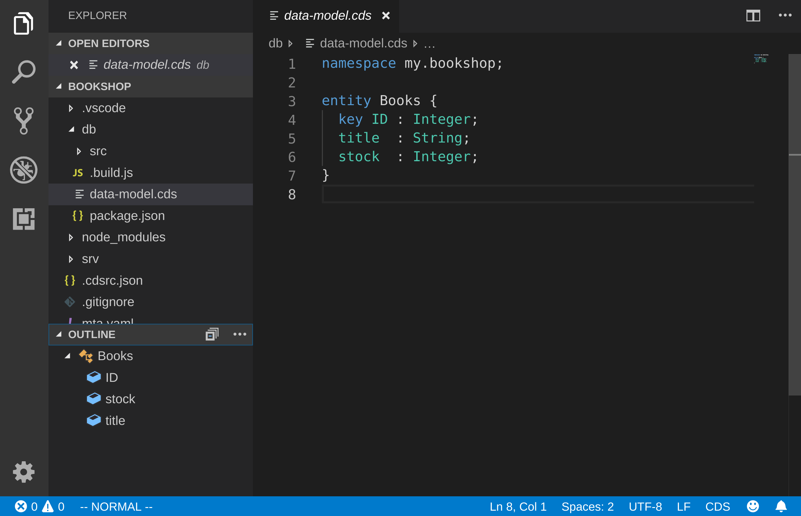
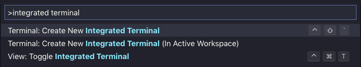
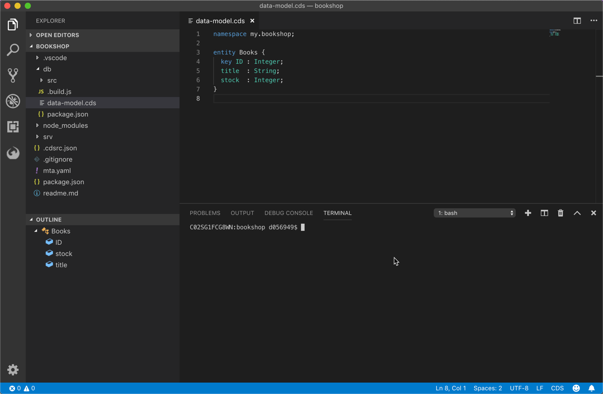
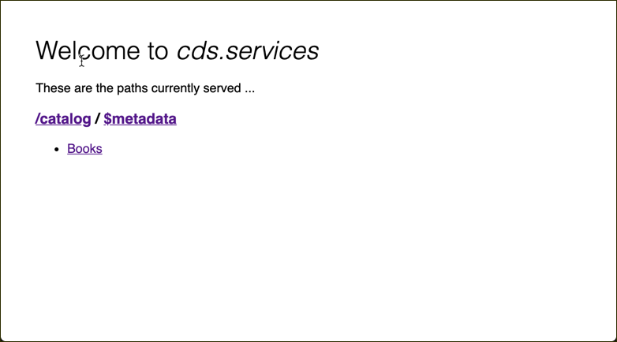

# Exercise 02 - Creating a new CAP project

In this exercise you'll become familiar with the workflow of creating a new CAP project from the command line, and discover how quickly you can get to a basic OData service serving a simple metadata document.

One of the challenges of building a full stack app using OData has been the production of an OData service - the definition of the metadata and the creation of the backend components to service the OData operations.

With Core Data & Services (CDS) as the definition language and CAP as the framework providing out-of-the-box services that respond to OData requests, that challenge has disappeared. It's very easy to get a basic OData service up and running in only a few minutes. Being able to rapidly get to a working metadata document has various benefits which we'll discuss at the end of this exercise.


## Steps

After completing these steps you'll be familiar with how you can use the CDS command line tool to initialize a project with an OData service.


### 1. Initialize a new CAP project

The first thing to do in any new CAP based project is to initialize that project by indirectly creating a directory with various basic files in it. This can be achieved with the CDS command line tool `cds` which you installed in [exercise 01](../01/).

The `cds` tool should be available in your executable path, having been installed as part of the Node.js `@sap/cds` package in the [previous exercise](../01/).

:point_right: First, explore the `cds` command line tool by executing it with no parameters; you will see what options are available:

```sh
user@host:~
=> cds

USAGE

    cds <command> [<args>]


COMMANDS

  c | compile    ...individual models (= the default)
  d | deploy     ...data models to a database
  s | serve      ...service models to REST clients
  b | build      ...whole modules or projects
  i | init       ...jump-starts a new project
  e | env        get/set current cds configuration
  r | repl       cds's read-eval-event-loop
  h | help       shows usage for cds and individual commands
  v | version    prints detailed version information

  cds help <command> gives more help about each (also with --help)
  cds <file> without <command> defaults to cds compile.
  cds without any arguments shows this help.


EXAMPLES

  cds model.cds
  cds compile model.cds
  cds compile model.json --to cdl
  cds serve cat-service
  cds build --clean
  cds compile --help
```

Note that with `cds init` a new project can be quickly initialized.

:point_right: Explore what options are available with `cds init` with the `--help` option:

```sh
user@host:~
=> cds init --help
```

Amongst other things, you should see a `--modules` option to specify a list of modules to be created when the project is initialized, and also a `--verbose` option.

:point_right: Use both of these options to initialize a new project directory thus:

```sh
user@host:~
=> cds init --modules db,srv --verbose bookshop
```

You should see output that looks similar to this:

```sh
Creating new project in directory bookshop.

Copying templates for type db to bookshop/db ...
Copying templates for type srv to bookshop/srv ...
Updating npm dependencies in bookshop/package.json ...
Running npm install...
npm WARN bookshop@1.0.0 license should be a valid SPDX license expression

added 76 packages from 109 contributors and audited 166 packages in 3.261s
found 0 vulnerabilities


Project creation was successful.
```


### 2. Open the project in VS Code

Now that the project has been initialized, it's time to explore it. The VS Code IDE is a comfortable environment in which to do so, so at this point you will open up the newly created `bookshop` directory in it.

:point_right: Open up the new `bookshop` directory in VS Code. One way to do this (if the installation of VS Code on your operating system put the binary in your executable path) is simply by invoking `code` on the command line, and specifying the directory to open:

```sh
user@host:~
=> code bookshop
```

If this approach is not available to you, simply start VS Code through your operating system's GUI and open the directory manually.


### 3. Explore the initialized project structure

The skeleton project that has been initialized is visible in VS Code. This is what it should look like (it shows also the `db/data-model.cds` file opened, which you can do manually):



:point_right: Examine what files have been populated in the project directory structure.

Briefly, the directories and contents can be described thus:

| Directory      | Contents |
| -------------- | -------- |
| `.vscode`      | VS Code specific files for launch configurations (useful for debugging, which we will cover in [exercise 08](../08/)) |
| `db`           | Where the data models (in CDS) are specified. A skeleton CDS project that has been initialized with the `--modules db` option will have a basic data model file in the form of `data-model.cds` with a small sample definition, like here |
| `node_modules` | This is the normal place where NPM packages (modules) are to be found in a Node.js based project |
| `srv`          | Where the service definitions (in CDS) are specified. A skeleton CDS project that has been initialized with the `--modules srv` option will have a basic service definition file in the form of `cat-service.cds` with a small service definition, like here |

Besides the directories there are also a number of files, including the project's `package.json` (present in any Node.js based project) and a readme file.


### 4. Examine the data model and service definition files

The key files in this project as far as the business domain is concerned are the `db/data-model.cds` and the `srv/cat-service.cds` files.

:point_right: Have a brief look inside each of these files to get a basic understanding of what's there. Note the use of the `namespace` and how it is defined in the data model and referenced in the service definition. Note also the how the different parts of each file are syntax highlighted, including the definitions and the annotations (which start with `@`).


### 5. Start up the service

Yes, you've not written a single line of code yet but you're going to start up the service in the skeleton project. VS Code has an integrated terminal which you can and should use for this and subsequent command line activities.

:point_right: Open the integrated terminal in VS Code. Do this by opening the Command Palette and searching for 'integrated terminal'. You may wish to use the keyboard shortcut for this - note there is a keyboard shortcut for toggling the integrated terminal in and out of view as well.



This should open up the terminal at the bottom of VS Code like this:



:point_right: In the integrated terminal, use the `cds` command line tool with the `serve` command to start serving. Specify the service definition directory `srv` in the invocation:

```sh
user@host:~/bookshop
=> cds serve srv
```

Note: You can also specify simply `cds serve all` to have `cds` look for appropriate configuration to serve. There is also currently a synonym `cds run` which will do essentially the same thing.

You should see output similar to this:

```
[cds] - server listening at http://localhost:4004
[cds] - serving CatalogService at /catalog
[cds] - service definitions loaded from:

  srv/cat-service.cds
  db/data-model.cds

[cds] - launched in: 448.633ms
```

The OData service is now running, and available on [http://localhost:4004](http://localhost:4004).


### 6. Explore the OData service

While we have no data in the OData service (we don't even have a persistence layer yet!) we can ask the OData service for the two well-known documents: the service document and the metadata document.

:point_right: Open [http://localhost:4004](http://localhost:4004) in your browser, to see something like this:



The [catalog](http://localhost:4004/catalog) link will take you to the service document and the [$metadata](http://localhost:4004/catalog/$metadata) link will take you to the metadata document.

:point_right: Explore the metadata document and familiarize yourself with the content. Note the entityset definition and the entity type describing the `Books` entity. Note also the annotations describing particular service capabilities.

:point_right: There is also a link to the [Books](http://localhost:4004/catalog/Books) entityset. Follow this link to see what the service returns.


## Summary

With a single command, you've initialized a basic OData service project and with another command you've started it up and explored the metadata.


## Questions

1. Why is there an focus on "TTM" (time to metadata) - what advantages does that bring?

1. What is the difference between the data model and the service definition? Why do we need both?

1. What are the annotations in the metadata document describing, and where do they come from?

1. What does the Books entityset resource contain right now?
