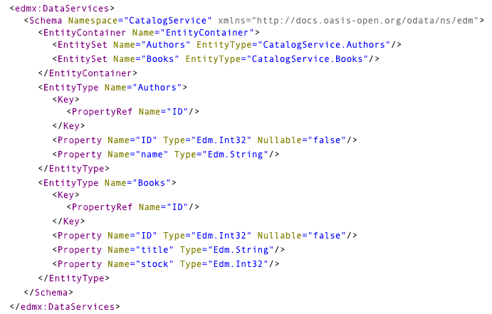
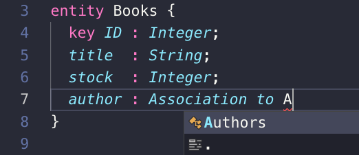
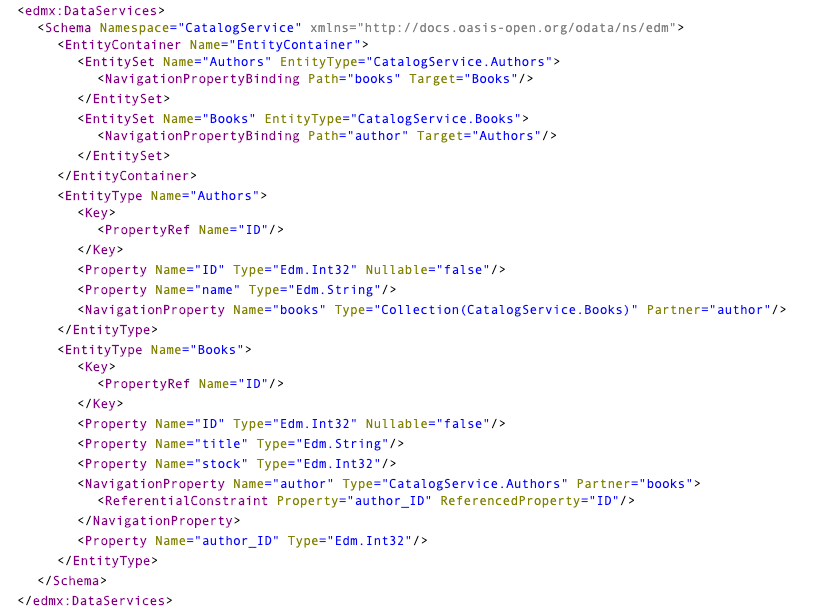

# Exercise 03 - Enhancing the project & adding persistence

In this exercise you'll enhance your basic bookshop project by adding to the data model and service definition, and creating a persistence layer.


## Steps

After completing these steps you'll have a slightly more complex OData service, with a second entity that is related to the first. It will also be backed by an actual persistence layer, provided by SQLite.


### 1. Add a new Authors entity to the model

Currently the data model is extremely simple. In this step you'll add a second entity `Authors`.

:point_right: Open the `db/data-model.cds` file in VS Code and add a new entity definition, after the `Books` entity, thus:

```cds
entity Authors {
  key ID : Integer;
  name   : String;
}
```

This is deliberately very simple at this point. Don't forget to save the file.

:point_right: In the integrated terminal, start (or restart) the service like this:

```sh
user@host:~/bookshop
=> cds serve all
```

(If you want, you can also use `cds serve srv` like you did in [exercise 02](../02/)).

:point_right: Open up (or refresh) the [service metadata document](http://localhost:4004/catalog/$metadata) and check for the entity definition you've just added.

You're right. It's not there.


### 2. Expose the Authors entity in the service

While there is now a second entity definition in the data model, it is not exposed in the existing service. In this step, you'll remedy that.

:point_right: Open up the `srv/cat-service.cds` file and add a second entity to the `CatalogService` definition. While you're there, remove the `@readonly` annotation that you see against the existing entity in the service - we will look at these annotations in a later exercise.

This is what the contents of `srv/cat-service.cds` should look like after you've added the new entity and removed the annotation:

```cds
using my.bookshop as my from '../db/data-model';

service CatalogService {
    entity Books as projection on my.Books;
    entity Authors as projection on my.Authors;
}
```

:point_right: Restart the service and check the metadata document once again. The definition of the Authors entity should now be present in the metadata, and will look something like this:



This is nice, but there's something fundamental that's missing and preventing this data model from being useful.


### 3. Add a relationship between the Books and Authors entities

The `Books` and `Authors` entities are standalone and currently are not related to each other. This is not ideal, so in this step you'll fix that by adding a relationship in the form of an [association](https://help.sap.com/viewer/65de2977205c403bbc107264b8eccf4b/Cloud/en-US/9ead8e4701d04848a6fdc84356723a52.html).

:point_right: Return to the `db/data-model.cds` file and add an association from the `Books` entity to the `Authors` entity, bearing in mind the simplified assumption that a book has a single author. The association should describe a new `author` property in the `Books` entity like this:

```cds
entity Books {
  key ID : Integer;
  title  : String;
  stock  : Integer;
  author : Association to Authors;
}
```

Note that as you type, the CDS Language Services extension that you installed in [exercise 01](../01/) provides very useful command completion, recognising the entities defined as well as the CDS syntax itself:



This `Association to Authors` relationship will allow a consumer to navigate from a book to the related author, but not from an author to their books. Let's fix that now by adding a second association.

:point_right: To the `Authors` entity, add a `books` property thus:

```cds
entity Authors {
  key ID : Integer;
  name   : String;
  books  : Association to many Books on books.author = $self;
}
```

Note that this is a 'to-many' relationship.

Don't forget to save the file.

:point_right: Restart the service and check the [metadata document](http://localhost:4004/catalog/$metadata) again. There should now be OData navigation properties defined between the two entities, like this:




### 4. Deploy the service to a persistence layer

As it stands, the OData service has no storage. We can actually simulate storage with [service provider](https://help.sap.com/viewer/65de2977205c403bbc107264b8eccf4b/Cloud/en-US/b9c34890348b4f2184e07a6731bce50b.html) logic in JavaScript but that's not a path we want to explore right now (we'll look at it in [exercise 08](../08/)). Instead, we'll use a real database in the form of [SQLite](https://sqlite.org) and deploy the data model and service definition to it.

:point_right: The `@sap/cds` package makes use of the NPM [sqlite3](https://www.npmjs.com/package/sqlite3) package, and this needs to be installed in the project first. Do this by using `npm` to install it locally to the project (rather than globally):

```sh
user@host:~/bookshop
=> npm install sqlite3 --save-dev
```

You should see output similar to this:

```
> sqlite3@4.0.6 install /Users/user/bookshop/node_modules/sqlite3
> node-pre-gyp install --fallback-to-build

node-pre-gyp WARN Using request for node-pre-gyp https download
[sqlite3] Success: "/Users/user/bookshop/node_modules/sqlite3/lib/binding/node-v57-darwin-x64/node_sqlite3.node" is installed via remote
npm notice created a lockfile as package-lock.json. You should commit this file.
npm WARN bookshop@1.0.0 license should be a valid SPDX license expression

+ sqlite3@4.0.6
added 101 packages from 88 contributors and audited 326 packages in 5.601s
found 0 vulnerabilities
```

Note: The `--save-dev` option here (short form: `-D`) causes the information about the dependency to the `sqlite3` package to be written to a separate section of the `package.json` file, which describes dependencies relating to the development process rather than the runtime operation. Here we're assuming that SQLite is being employed for development and testing purposes only.

:point_right: Explore the `cds deploy` command like this:

```sh
user@host:~/bookshop
=> cds deploy --help

SYNOPSIS

    cds deploy [ <model> ] [ --to <database> ]

    Deploys the given model to a database. If no model is given it looks up
    according configuration from package.json or .cdsrc.json in key
    cds.requires.db.  Same for the database.
```

Use this command to deploy the data model and service definition to a new SQLite-based database (databases with SQLite are simply files on the local filesystem).

:point_right: Deploy to a new SQLite database like this:

```
user@host:~
=> cds deploy --to sqlite:bookshop.db
```

This should complete fairly quietly, and give a message like this:

```
- updated package.json
```

Note: If you're wondering what has been updated in `package.json`, have a look. You'll see that a new section has been created that describes the persistence layer configuration:

```json
  "cds": {
    "requires": {
      "db": {
        "kind": "sqlite",
        "model": [
          "db",
          "srv"
        ],
        "credentials": {
          "database": "bookshop.db"
        }
      }
    }
  }
```


### 5. Explore the new database

At this point you should have a new file `bookshop.db` in the project folder.

Note: There is no hard requirement to name the SQLite database file `bookshop.db` here - it is just done for neatness and consistency.

:point_right: Have a look inside it with the `sqlite3` command line utility; use the `.tables` command to see what has been created:

```sh
user@host:~/bookshop
=> sqlite3 bookshop.db
SQLite version 3.22.0 2018-01-22 18:45:57
Enter ".help" for usage hints.
sqlite> .tables
CatalogService_Authors  my_bookshop_Authors
CatalogService_Books    my_bookshop_Books
sqlite> .quit
user@host:~/bookshop
```

Note: The `sqlite3` command line utility is not related to the `sqlite3` NPM package you just installed; it came from the installation of SQLite itself as described in the [prerequisites](../../prerequisites.md).


### 6. Dig into the link between the CDS definitions and the artefacts in the database

Looking at the tables in the `bookshop.db` database we see that there are two pairs of names; one pair prefixed with `CatalogService` and the other pair prefixed with `my_bookshop`. If you guessed that the `CatalogService`-prefixed artefacts relate to the service definition and the `my_bookshop`-prefixed artefacts relate to the data model, you are correct.

In this step you'll look briefly at what these artefacts are and how they are created.

The `cds compile` command turns CDS definitions into different target outputs. In the case of our project based on SQLite, this output needs to be in the form of Data Definition Language (DDL) commands.

When running the `cds deploy` command, this compilation is done as part of the process. But you can also see it explicitly.

:point_right: Do that now, first for the data definitions, with:

```sh
user@host:~/bookshop
=> cds compile db --to sql
```

This will produce SQL data definition language commands like this:

```sql
CREATE TABLE my_bookshop_Authors (
  ID INTEGER,
  name NVARCHAR(5000),
  PRIMARY KEY(ID)
);

CREATE TABLE my_bookshop_Books (
  ID INTEGER,
  title NVARCHAR(5000),
  stock INTEGER,
  author_ID INTEGER,
  PRIMARY KEY(ID)
);
```

:point_right: Now try it for the service definition:

```sh
user@host:~/bookshop
=> cds compile srv --to sql
```

You should see output like this:

```sql
CREATE TABLE my_bookshop_Authors (
  ID INTEGER,
  name NVARCHAR(5000),
  PRIMARY KEY(ID)
);

CREATE TABLE my_bookshop_Books (
  ID INTEGER,
  title NVARCHAR(5000),
  stock INTEGER,
  author_ID INTEGER,
  PRIMARY KEY(ID)
);

CREATE VIEW CatalogService_Authors AS SELECT
  "AUTHORS_$0".ID,
  "AUTHORS_$0".name
FROM my_bookshop_Authors AS "AUTHORS_$0";

CREATE VIEW CatalogService_Books AS SELECT
  "BOOKS_$0".ID,
  "BOOKS_$0".title,
  "BOOKS_$0".stock,
  "BOOKS_$0".author_ID
FROM my_bookshop_Books AS "BOOKS_$0";
```

Observe that compiling the service definition will automatically produce DDL for the entities in the data model, as the service refers to them. Observe also that the service artefacts are views, whereas the data model artefacts are tables.


## Summary

You now have a fully functional, albeit simple, OData service backed by a persistence layer, where the data is stored in a local SQLite database file.


## Questions

1. What happens to the content of `package.json` after a deploy?

1. What are other possible targets in the compilation context?

1. What is the thinking behind the use of views at the service definition layer and tables at the data model layer?

1. Even though the `Authors` entity definition finally appeared in the metadata file at the end of step 2, you might have noticed that the content of the metadata document looked shorter overall than it did. What disappeared?
