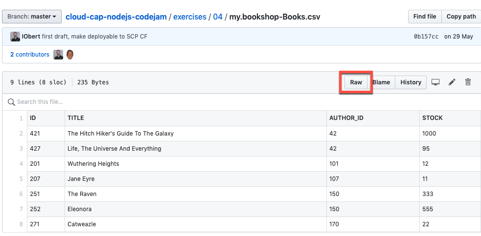
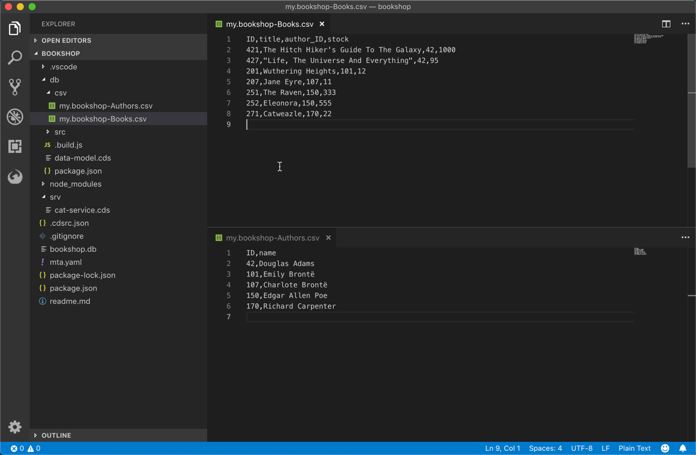
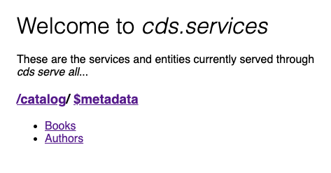

# Exercise 04 - Adding data & testing OData operations

In [exercise 03](../03/) you deployed the service definition (including the referenced data model) to a SQLite-powered persistence layer. While at this stage the OData service is working nicely, we don't yet have data to explore with.

In this exercise you'll seed the persistence layer with data from CSV files, which is often a great way to kick start exploration, development and testing in the early stages of a project.


## Steps

After completing these steps you'll have some authors and books data in your OData service and will have explored that data in the browser with OData query operations.


### 1. Bring sample CSV files in the project

The SAP Cloud Application Programming Model adopts a "convention over configuration" approach in many areas, one of which is the automatic recognition and loading of data from CSV files during a deployment. In this step you'll create a `csv/` directory in the `db/` directory, add two CSV files (one for each of the entities) and redeploy. The deployment process will spot the CSV files and load the contents into the tables in the persistence layer.

:point_right: Create a `csv/` directory within the `db/` directory, and copy into it the CSV files (from this repository) [my.bookshop-Books.csv](my.bookshop-Books.csv) and [my.bookshop-Authors.csv](my.bookshop-Authors.csv). Use the "Raw" link from within each of these GitHub resources to get the actual CSV data to download (and don't forget to ensure the `.csv` extension is used for the files that you save).



Your directory structure should then look something like this (the screenshot also shows the content of the two CSV files):




### 2. Redeploy to the persistence layer

:point_right: The CSV files are discovered and used during a `cds deploy`, so deploy again thus:

```sh
user@host:~/bookshop
=> cds deploy
```

During deployment this time you should see an extra message:

```
> initializing from csv files at ./db/csv...
```


### 3. Add config files for HANA

The `.hdiconfig` file specifies the configuration of the HANA Deployment Infrastructure (HDI) container that will be used when deploying to SAP Cloud Platform.

:point_right: Change the value of the following property in the `db/src/.hdiconfig` file to adapt the version to the HANA version used in the SAP Cloud Platform Cloud Foundry trial:

```
"plugin_version": "12.1.0",
```

While SQLite automatically imports the CSV files, we need to provide more information for HANA to import those files. These import instructions are encoded in a `.hdbtabledata` file and will be read during the deployment process to the Cloud Foundry environment.

 :point_right: Create a new `db/csv/Data.hdbtabledata` file with the following content to specify which data should be imported into the HANA tables:

```
{
   "format_version": 1,
   "imports": [
       {
           "target_table": "MY_BOOKSHOP_AUTHORS",
           "source_data": {
           "data_type": "CSV",
               "file_name": "my.bookshop-Authors.csv",
               "has_header": true
           },
           "import_settings": {
           "import_columns": [
                   "ID",
                   "NAME"
               ]
           }
       },
       {
           "target_table": "MY_BOOKSHOP_BOOKS",
           "source_data": {
           "data_type": "CSV",
               "file_name": "my.bookshop-Books.csv",
               "has_header": true
           },
           "import_settings": {
           "import_columns": [
                   "ID",
                   "TITLE",
                   "AUTHOR_ID",
                   "STOCK"
               ]
           }
       }
   ]
}
```

### 4. Restart the service

:point_right: Restart the service thus:

```sh
user@host:~/bookshop
=> cds serve all
```

Now the [Books](http://localhost:4004/catalog/Books) and [Authors](http://localhost:4004/catalog/Authors) entitysets in the OData service will show data in response to OData query and read operations.




### 5. Try out some OData query operations

The [OData standard](https://www.odata.org/) describes a number of different operations - Create, Read, Update, Delete and Query (otherwise known as 'CRUD+Q'). With your browser you can try out Read and Query operations directly.

:point_right: Try out a few Read and Query operations on the data in the service like this:

| Read / Query | URL |
| ----- | --- |
| Show all books | http://localhost:4004/catalog/Books |
| Show all authors | http://localhost:4004/catalog/Authors |
| Retrieve book with ID 421 | http://localhost:4004/catalog/Books(421) |
| Retrieve author with ID 42 and also their books | http://localhost:4004/catalog/Authors(42)?$expand=books |


## Summary

Your OData service now has sample data that you can access via OData operations.


## Questions

1. Does the order of the fields defined in the CSV files have to match the order of the properties defined in the entities in the data model?

1. Where do you think the format of the CSV file names has come from?
