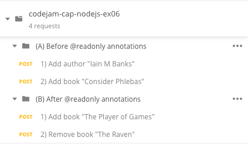
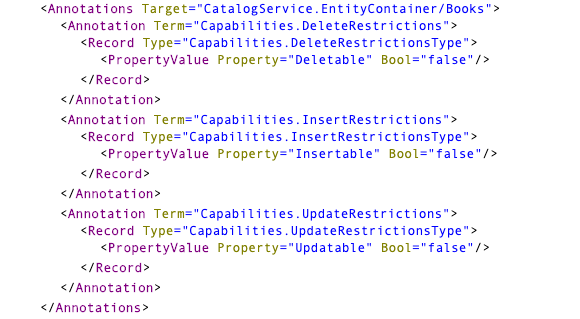
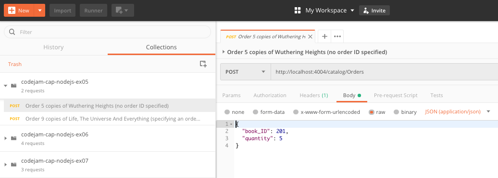

# Exercise 06 - Enhancing the service with annotations

In this exercise you'll enhance the service definition with annotations that restrict the OData operations that are allowed.


## Steps

At the end of these steps, your OData service will have different levels of access for each of the entities.


### 1. Import a collection of HTTP requests into Postman

:point_right: In the same way that you did in [exercise 05](../05/), import a collection of HTTP requests into your Postman client via the URL to [postman-06.json](https://raw.githubusercontent.com/qmacro/codejam-cap-nodejs/master/exercises/06/postman-06.json) resource.

This contains a number of different requests ready for you to try.

Note: If you still want to use `curl`, you'll find the command line invocations in the appropriate steps below.




### 2. Test the existing write access to Books and Authors

Right now the `Books` and `Authors` entities are exposed in the `CatalogService` service. In the subsequent steps in this exercise we'll be tightening the restrictions down to read-only. Before we do, let's check to see that, at least currently, we have write access. We'll do that by making a couple of OData Create operations, one to create a new author, and the other to add a book by that author.

:point_right: In the Postman collection you imported, try out the requests in the folder "**(A) Before @readonly annotations**", running them in the order they're presented (the creation of the new book is for the new author, which needs to exist first).

If you want to use `curl` instead of Postman, use the following invocations on the command line:

1) Add author "Iain M Banks":
```
curl \
  -d '{"ID": 162, "name": "Iain M Banks"}' \
  -H 'Content-Type: application/json' \
  http://localhost:4004/catalog/Authors
```

2) Add book "Consider Phlebas":
```
curl \
  -d '{"ID": 44138, "title": "Consider Phlebas", "stock": 541, "author_ID": 162 }' \
  -H 'Content-Type: application/json' \
  http://localhost:4004/catalog/Books
```

Check that the creation requests are successful, and that you can see the new author and book in an OData Query operation: [http://localhost:4004/catalog/Authors?$expand=books](http://localhost:4004/catalog/Authors?$expand=books).


### 3. Restrict access to the Books and Authors entities

Now, we want to only allow read-only operations on the master data. This can be achieved with OData annotations that are encapsulated into a convenient `@readonly` [shortcut](https://help.sap.com/viewer/65de2977205c403bbc107264b8eccf4b/Cloud/en-US/227cbf1a3ec24075a3aaaf6202f88be5.html).

:point_right: Add this `@readonly` shortcut to each of the `Books` and `Authors` specifications in the `CatalogService` thus:

```cds
service CatalogService {
    @readonly entity Books as projection on my.Books;
    @readonly entity Authors as projection on my.Authors;
    entity Orders as projection on my.Orders;
}
```

What does this do, precisely? Let's find out.

:point_right: First save the file then redeploy & restart the service, like you did in [exercise 05](../05/):

```sh
user@host:~/bookshop
=> cds deploy && cds serve all
```

:point_right: Now examine the OData service's [metadata](http://localhost:4004/catalog/$metadata), and you should find annotations that look like this:



Is this just a recommendation that can be overridden? Let's find out.


### 4. Attempt to modify the Books and Authors entitysets

We can think of the annotations that we saw in the metadata document as guidelines for a UI, but we want to ensure that the restrictions are really in effect in the service itself. Let's try to create another entry in the `Books` entityset.

:point_right: In the same Postman collection you imported, try out the first request in the folder "**(B) After @readonly annotations**".

If you want to use `curl` instead of Postman, use the following invocation on the command line:

1) Add book "The Player of Games":
```
curl \
  -d '{"ID": 47110, "title": "The Player of Games", "stock": 405, "author_ID": 162 }' \
  -H 'Content-Type: application/json' \
  http://localhost:4004/catalog/Books
```

The request is an OData Create request for a new book. You should see that this request is rejected with HTTP status code 405 "Method Not Allowed", with an error like this supplied in the response body:

```json
{
    "error": {
        "code": "405",
        "message": "Method Not Allowed"
    }
}
```

You should also see a line in the terminal (where you invoked `cds serve all`) like this:

```
[2019-03-26T06:39:23.025Z | WARNING | 1369756]: An error occurred: Method Not Allowed
```

:point_right: Next, try out the second request in that same folder - it's an OData Delete operation, to remove a book.

If you want to use `curl` instead of Postman, use the following invocation on the command line:

2) Remove book "The Raven":
```
curl \
  -X DELETE \
  'http://localhost:4004/catalog/Books(251)'
```

It should also fail in a similar way.

_TIP: If you end up destroying your test data, you can easily restore it by redeploying (`cds deploy`), as the test data will be re-seeded from the CSV files._


### 5. Restrict access to the Orders entityset

In a similar way to how we restricted access to the `Books` and `Authors` entitysets to read-only operations, we will now restrict access to the `Orders` entityset so that orders can only be created, and not viewed, amended or removed.

As you might have guessed, this is achieved via the `@insertonly` annotation shortcut.

:point_right: In the `CatalogService` service definition in `srv/cat-service.cds`, annotate the `Orders` entity with `@insertonly` so it looks like this:

```cds
service CatalogService {
    @readonly entity Books as projection on my.Books;
    @readonly entity Authors as projection on my.Authors;
    @insertonly entity Orders as projection on my.Orders;
}
```

:point_right: Redeploy and restart the service (run `cds deploy && cds serve all` in the terminal).

:point_right: Now create a couple of orders using the Postman collection from [exercise 05](../05/) - there should be a couple of POST requests against the `Orders` entityset (refer to the step in exercise 05 for the `curl` invocations if you wish).



Note at this point that the requests are successful: HTTP status code 201 is returned for each request, along with the newly created entity in the response payload, like this example:

```json
{
    "@odata.context": "$metadata#Orders/$entity",
    "@odata.metadataEtag": "W/\"qItYMyHC4RMSWG6mehaOHDxo+o/HzUCPMchqSx7hd1k=\"",
    "ID": "527ef85a-aef2-464b-89f6-6a3ce64f2e14",
    "modifiedAt": null,
    "createdAt": "2019-03-26T06:51:52Z",
    "createdBy": "anonymous",
    "modifiedBy": null,
    "quantity": 9,
    "book_ID": 427,
    "country_code": null
}
```

Further, you can see the request logged in the terminal, with no sign of any errors:

```
POST /catalog/Orders
```

This confirms we can insert new orders. But can we see what they are?

:point_right: Try to perform an OData Query operation on the `Orders` entityset, simply by requesting this URL: [http://localhost:4004/catalog/Orders](http://localhost:4004/catalog/Orders).

The operation should be denied, and you'll receive something like this in the body of the response in your browser:

```xml
<error xmlns="http://docs.oasis-open.org/odata/ns/metadata">
<code>405</code>
<message>Method Not Allowed</message>
</error>
```


## Summary

In this exercise you used shortcut annotations to restrict access to the entities expose in the service definition. The annotations provide not only information to be used by consumers (such as frontends) but also control access at the HTTP level.


## Questions

1. What are the advantages to separating the data model and service layers? Are there any disadvantages?

1. How might the annotations relating to the read-only restrictions be useful in a UI context?

1. What was the format of the OData Delete operation - did we need to supply a payload?
